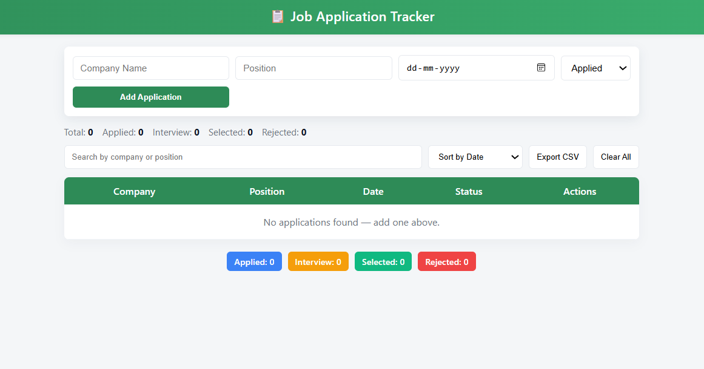
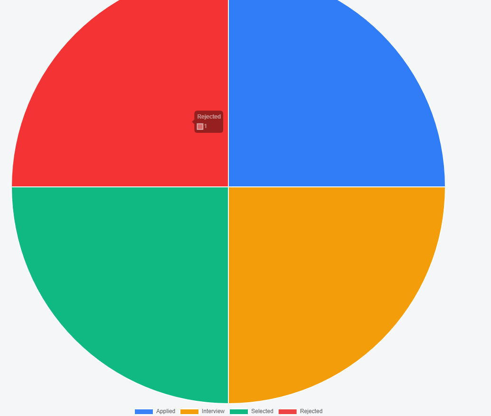

# 📋 Job Application Tracker

A **modern, lightweight web application** that helps you track all your job applications efficiently.  
Built using **HTML, CSS, and JavaScript**, it offers an elegant interface to manage your job hunt with features like search, sorting, CSV export, and dynamic status tracking.

---

## 🌟 Features

- 📝 Add, Edit & Delete job applications easily
- 🧩 Status tracking — Applied, Interview, Selected, or Rejected
- 🔍 Search and Sort by company name or date
- 💾 Auto-save with LocalStorage — no backend needed
- 📊 Dynamic badges and counters update automatically
- 📤 Export your data to CSV for offline backup
- 🧠 Fully client-side app — fast, private, and easy to use

---

## 🛠️ Technologies Used

- HTML5 — for structure and layout
- CSS3 — for modern styling and responsiveness
- JavaScript (ES6) — for logic and interactivity
- LocalStorage API — for persistent data storage

---

## 📁 Project Structure

job-application-tracker/
│
├── index.html → Main structure of the app  
├── style.css → Styling and layout  
├── script.js → Logic and interactivity  
│
├── assets/ → Images, icons, and screenshots  
│ ├── form-view.png  
│ └── dashboard-view.png  
│
└── README.md → Project documentation

---

## 🚀 How to Run Locally

1️⃣ Clone the Repository  
git clone https://github.com/MrsRathode/job-application-tracker.git  
cd job-application-tracker

2️⃣ Run the App  
Option A: Open `index.html` directly in your browser  
Option B: Use **Live Server** in VS Code for auto-refresh and a better experience

---

## 🧠 How It Works

• Each job application is stored locally in your browser using LocalStorage.  
• You can add, edit, delete, or update the application status (Applied, Interview, Selected, Rejected).  
• The dashboard updates dynamically with counters and color-coded badges.  
• All changes are instantly saved — even if you close or refresh the page.  
• Everything runs fully client-side for speed and privacy.

---

## 📈 Future Enhancements

• Add job deadlines and reminders  
• Sync data with Google Sheets or Firebase  
• Integrate with email/calendar APIs  
• Add charts and analytics to visualize progress

---

## 🖼️ Screenshots

| Dashboard View |
| -------------- |

| 

| Add Application Form |
| -------------------- |

 |  |

## 🌐 Live Demo

👉 Try it live here: https://your-live-demo-link.com

---

## 🤝 Contributing

Contributions, ideas, and feedback are always welcome!  
Feel free to fork this repository, open an issue, or submit a pull request.

---

## 🧑‍💻 Built By

👩‍💻 **Anusha**  
💚 Built with love using HTML, CSS, and JavaScript.  
If you like this project, consider giving it a ⭐ on GitHub!

---

## 📜 License

This project is licensed under the **MIT License**.  
You are free to use, modify, and share it for learning or personal projects.

---

> 🧩 Built with ❤️ by Anusha — making job tracking smarter and simpler.
